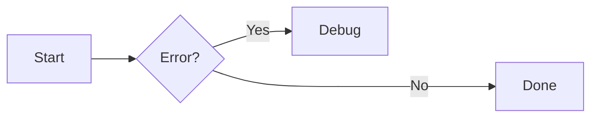

# Authoring

## Markdown Basics

Zensical uses Python Markdown (compatible with Material for MkDocs). Use relative links to other Markdown files — Zensical translates them to correct HTML links:

```markdown
[See setup guide](../setup/basics.md)
```

Page title priority: nav config → front matter title → first `#` heading → filename.

---

## Front Matter

Front matter is YAML at the top of a Markdown file between `---` delimiters.

```yaml
---
title: My Page Title
description: A short description for the HTML meta tag.
icon: lucide/braces
status: new
template: my_template.html
tags:
  - HTML5
  - JavaScript
hide:
  - navigation
  - toc
  - footer
  - path
  - tags
  - feedback
search:
  exclude: true
robots: noindex, nofollow
---
```

### Page status

Define statuses in config:

```toml
[project.extra.status]
new = "Recently added"
deprecated = "Deprecated"
```

Built-in identifiers: `new`, `deprecated`.

---

## Admonitions

Requires: `admonition`, `pymdownx.details`, `pymdownx.superfences` extensions.

```markdown
!!! note
    Content here, indented 4 spaces.

!!! note "Custom title"
    Content with a custom title.

!!! note ""
    Admonition with no title.
```

### Collapsible

```markdown
??? note
    Collapsed by default.

???+ note
    Expanded by default.
```

### Inline

```markdown
!!! info inline end "Title"
    Floats to the right.

!!! info inline "Title"
    Floats to the left.
```

Inline admonitions must be declared before the content block they float beside.

### Supported types

`note`, `abstract`, `info`, `tip`, `success`, `question`, `warning`, `failure`, `danger`, `bug`, `example`, `quote`

### Custom admonition icons

```toml
[project.theme.icon.admonition]
note = "octicons/tag-16"
warning = "octicons/alert-16"
```

---

## Code Blocks

Requires: `pymdownx.highlight`, `pymdownx.inlinehilite`, `pymdownx.snippets`, `pymdownx.superfences`.

````markdown
``` python
import tensorflow as tf
```
````

### With title

````markdown
``` python title="bubble_sort.py"
def bubble_sort(items):
    pass
```
````

### Line numbers

````markdown
``` python linenums="1"
def example():
    pass
```
````

### Highlight lines

````markdown
``` python hl_lines="2 3"
def example():
    line_two = True
    line_three = True
```
````

Line ranges:

````markdown
``` python hl_lines="2-4"
```
````

### Code annotations

````markdown
``` toml
features = ["content.code.annotate"] # (1)!
```

1.  I'm a code annotation! I can contain `code`, **text**, images.
````

Strip comment characters with `!`:

````markdown
``` yaml
# (1)!
```

1.  Look ma, less line noise!
````

### Inline code highlighting

```markdown
The `#!python range()` function generates a sequence.
```

### Embed external files

````markdown
``` title=".browserslistrc"
;--8<-- ".browserslistrc"
```
````

### Copy/select buttons

```toml
[project.theme]
features = ["content.code.copy", "content.code.select"]
```

Per-block override using attribute lists:

````markdown
``` { .yaml .copy }
key: value
```
````

---

## Content Tabs

Requires: `pymdownx.superfences`, `pymdownx.tabbed` with `alternate_style = true`.

```markdown
=== "Python"

    ``` python
    print("Hello")
    ```

=== "JavaScript"

    ``` javascript
    console.log("Hello")
    ```
```

### Linked tabs (sync across page)

```toml
[project.theme]
features = ["content.tabs.link"]
```

### Tabs in admonitions

```markdown
!!! example

    === "Option A"
        Content A

    === "Option B"
        Content B
```

---

## Data Tables

Requires: `tables` extension.

```markdown
| Method   | Description        |
| -------- | ------------------ |
| `GET`    | Fetch resource     |
| `PUT`    | Update resource    |
| `DELETE` | Delete resource    |
```

### Column alignment

```markdown
| Left     | Center  | Right   |
| :------- | :-----: | ------: |
| A        | B       | C       |
```

### Sortable tables

Add tablesort via extra JavaScript:

```javascript
document$.subscribe(function() {
  var tables = document.querySelectorAll("article table:not([class])")
  tables.forEach(function(table) {
    new Tablesort(table)
  })
})
```

```toml
[project]
extra_javascript = [
  "https://unpkg.com/tablesort@5.3.0/dist/tablesort.min.js",
  "javascripts/tablesort.js"
]
```

---

## Diagrams (Mermaid.js)

Requires: `pymdownx.superfences` with `custom_fences` for mermaid.

```toml
[project.markdown_extensions.pymdownx.superfences]
custom_fences = [
  { name = "mermaid", class = "mermaid", format = "pymdownx.superfences.fence_code_format" }
]
```

````markdown

````

Supported diagram types: flowcharts (`graph`), sequence diagrams (`sequenceDiagram`), state diagrams (`stateDiagram-v2`), class diagrams (`classDiagram`), entity-relationship diagrams (`erDiagram`).

Other types (pie charts, gantt, user journeys, git graphs, requirement diagrams) work but are not officially supported.

---

## Footnotes

Requires: `footnotes` extension.

```markdown
Lorem ipsum[^1] dolor sit amet.[^2]

[^1]: Short footnote on one line.

[^2]:
    Multi-line footnote, indented by four spaces.
    More content here.
```

### Footnote tooltips

```toml
[project.theme]
features = ["content.footnote.tooltips"]
```

---

## Formatting

Requires: `pymdownx.caret`, `pymdownx.mark`, `pymdownx.tilde`, `pymdownx.keys`.

```markdown
- ==highlighted==
- ^^underline/inserted^^
- ~~strikethrough/deleted~~
- H~2~O
- A^T^A
- ++ctrl+alt+del++
```

---

## Grids

Requires: `attr_list`, `md_in_html`.

### Card grid (list syntax)

```html
<div class="grid cards" markdown>

- :fontawesome-brands-html5: __HTML__ for content and structure
- :fontawesome-brands-js: __JavaScript__ for interactivity

</div>
```

### Card grid (complex, block syntax)

```html
<div class="grid cards" markdown>

-   :material-clock-fast:{ .lg .middle } __Set up in 5 minutes__

    ---

    Install and get started quickly.

    [:octicons-arrow-right-24: Getting started](#)

</div>
```

### Generic grid

```html
<div class="grid" markdown>

=== "Tab A"
    Content A

=== "Tab B"
    Content B

</div>
```

---

## Icons and Emojis

Requires: `attr_list`, `pymdownx.emoji`.

```markdown
:smile:
:fontawesome-regular-face-laugh-wink:
:material-heart:
:octicons-heart-fill-24:
:simple-lucide:
```

Included icon sets: Lucide, Material Design, FontAwesome, Octicons, Simple Icons.

### Icon with color

```markdown
:fontawesome-brands-youtube:{ .youtube }
```

```css
.youtube {
  color: #EE0F0F;
}
```

### Icon in template

```html
<span class="twemoji">
  
</span>
```

---

## Images

Requires: `attr_list`, `md_in_html`, `pymdownx.blocks.caption`.

```markdown
{ align=left }
{ align=right }
{ loading=lazy }
```

### Caption

```markdown
{ width="300" }
/// caption
Image caption
///
```

Or using HTML:

```html
<figure markdown="span">
  { width="300" }
  <figcaption>Caption text</figcaption>
</figure>
```

### Light and dark mode images

```markdown


```

---

## Lists

Requires: `def_list`, `pymdownx.tasklist` (for definition and task lists).

### Unordered

```markdown
- Item one
- Item two
    * Nested item
```

### Ordered

```markdown
1.  First item
2.  Second item
    1.  Nested
```

### Definition list

```markdown
`Term`
:   Definition text here.
```

### Task list

```markdown
- [x] Completed task
- [ ] Incomplete task
    * [x] Nested done
    * [ ] Nested todo
```

---

## Math

### MathJax

Add `docs/javascripts/mathjax.js`:

```javascript
window.MathJax = {
  tex: {
    inlineMath: [["\\(", "\\)"]],
    displayMath: [["\\[", "\\]"]],
    processEscapes: true,
    processEnvironments: true
  },
  options: {
    ignoreHtmlClass: ".*|",
    processHtmlClass: "arithmatex"
  }
};

document$.subscribe(() => {
  MathJax.startup.output.clearCache()
  MathJax.typesetClear()
  MathJax.texReset()
  MathJax.typesetPromise()
})
```

```toml
[project]
extra_javascript = [
  "javascripts/mathjax.js",
  "https://unpkg.com/mathjax@3/es5/tex-mml-chtml.js"
]

[project.markdown_extensions.pymdownx.arithmatex]
generic = true
```

Block math:

```latex
$$
\cos x=\sum_{k=0}^{\infty}\frac{(-1)^k}{(2k)!}x^{2k}
$$
```

Inline math:

```latex
The function $f$ is injective if and only if $a \neq b$.
```

### KaTeX

```toml
[project]
extra_javascript = [
  "javascripts/katex.js",
  "https://unpkg.com/katex@0/dist/katex.min.js",
  "https://unpkg.com/katex@0/dist/contrib/auto-render.min.js"
]
extra_css = ["https://unpkg.com/katex@0/dist/katex.min.css"]

[project.markdown_extensions.pymdownx.arithmatex]
generic = true
```

---

## Tooltips and Abbreviations

Requires: `abbr`, `attr_list`, `pymdownx.snippets`.

### Inline tooltip on link

```markdown
[Hover me](https://example.com "I'm a tooltip!")
```

### Tooltip on element

```markdown
:material-information-outline:{ title="Important information" }
```

### Abbreviations

```markdown
The HTML specification is maintained by the W3C.

*[HTML]: Hyper Text Markup Language
*[W3C]: World Wide Web Consortium
```

### Glossary (auto-append)

```toml
[project.markdown_extensions.pymdownx.snippets]
auto_append = ["includes/abbreviations.md"]
```

### Improved tooltips feature

```toml
[project.theme]
features = ["content.tooltips"]
```

---

## Buttons

Requires: `attr_list`.

```markdown
[Subscribe](#){ .md-button }
[Subscribe](#){ .md-button .md-button--primary }
[Send :fontawesome-solid-paper-plane:](#){ .md-button }