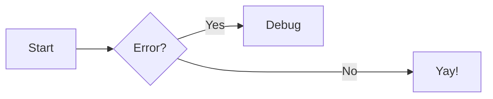
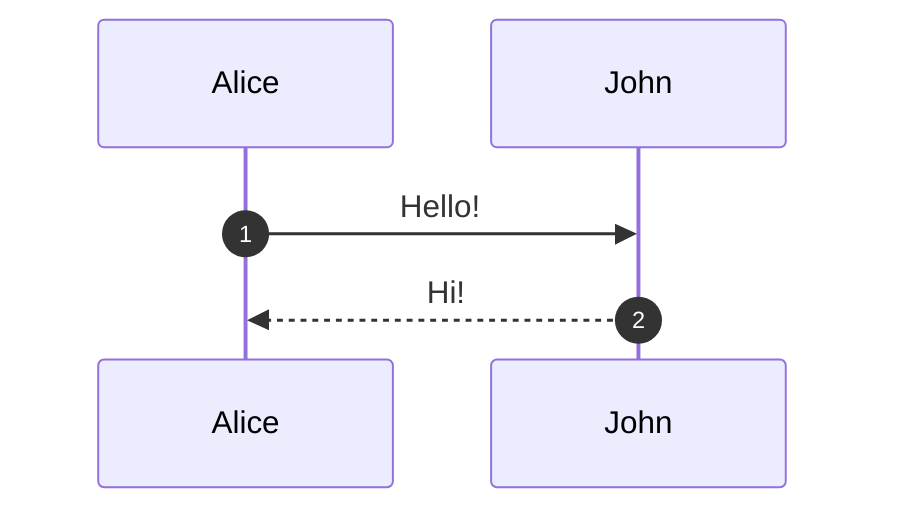

# Authoring

## Markdown Basics

Zensical uses Python Markdown for compatibility with Material for MkDocs. All standard Markdown is supported. Always use relative links to `.md` files rather than HTML URLs.

Page title priority (highest to lowest):
1. Title in `nav` config
2. Front matter `title`
3. First `# h1` in content
4. Filename

## Front Matter

```yaml
---
title: My Page Title
description: A short description for SEO.
icon: lucide/braces
status: new
template: my_homepage.html
hide:
  - navigation
  - toc
  - footer
  - feedback
  - tags
  - path
tags:
  - Setup
  - Authoring
---
```

### Page Status

Define statuses in config:

```toml
[project.extra.status]
new = "Recently added"
deprecated = "Deprecated"
```

Then use in front matter: `status: new`.

Built-in statuses: `new`, `deprecated`.

### Search Exclusion

```yaml
---
search:
  exclude: true
---
```

Exclude a section:

```markdown
## Section { data-search-exclude }
```

## Admonitions

Requires `admonition` extension (enabled by default).

```markdown
!!! note

    Content here, indented 4 spaces.
```

### Custom Title

```markdown
!!! note "My custom title"

    Content.
```

### No Title

```markdown
!!! note ""

    Content without title.
```

### Nested Admonitions

```markdown
!!! note "Outer"

    Outer content.

    !!! note "Inner"

        Inner content.
```

### Collapsible Blocks

Requires `pymdownx.details`.

```markdown
??? note

    Collapsed by default.

???+ note

    Expanded by default.
```

### Inline Blocks

```markdown
!!! info inline end "Title"

    Floats to the right.

!!! info inline "Title"

    Floats to the left.
```

Inline admonitions must be declared before the content block they sit beside.

### Supported Types

`note`, `abstract`, `info`, `tip`, `success`, `question`, `warning`, `failure`, `danger`, `bug`, `example`, `quote`

### Custom Admonition Icons

```toml
[project.theme.icon.admonition]
note = "octicons/tag-16"
warning = "octicons/alert-16"
```

## Code Blocks

### Basic Syntax

````markdown
``` py
import tensorflow as tf
```
````

### With Title

````markdown
``` py title="bubble_sort.py"
def bubble_sort(items):
    pass
```
````

### With Line Numbers

````markdown
``` py linenums="1"
def bubble_sort(items):
    pass
```
````

### Highlight Specific Lines

````markdown
``` py hl_lines="2 3"
def bubble_sort(items):
    for i in range(len(items)):
        pass
```
````

Line ranges: `hl_lines="3-5"`.

### Code Annotations

````markdown
``` toml
features = ["content.code.annotate"] # (1)!
```

1.  I'm a code annotation! I can contain `code`, __formatted text__, images.
````

Strip comment characters with `!` after `)`:

````markdown
``` yaml
# (1)!
```

1.  Look ma, less line noise!
````

### Inline Code Highlighting

```markdown
The `#!python range()` function generates sequences.
```

### Embed External Files

````markdown
``` title=".browserslistrc"
;--8<-- ".browserslistrc"
```
````

### Copy Button

```toml
[project.theme]
features = ["content.code.copy"]
```

Per-block: ` ``` { .yaml .copy } ` or ` ``` { .yaml .no-copy } `.

### Selection Button

```toml
[project.theme]
features = ["content.code.select"]
```

### Custom Annotation Selectors

```toml
[project.extra.annotate]
json = [".s2"]
```

## Content Tabs

Requires `pymdownx.superfences` and `pymdownx.tabbed` with `alternate_style = true`.

```markdown
=== "C"

    ``` c
    #include <stdio.h>
    int main(void) { return 0; }
    ```

=== "C++"

    ``` c++
    #include <iostream>
    int main(void) { return 0; }
    ```
```

### Linked Tabs (site-wide sync)

```toml
[project.theme]
features = ["content.tabs.link"]
```

### Anchor Links

Tabs automatically get anchor links. Enable slugification:

```toml
[project.markdown_extensions.pymdownx.tabbed.slugify]
object = "pymdownx.slugs.slugify"
kwds = { case = "lower" }
```

## Data Tables

```markdown
| Method   | Description          |
| -------- | -------------------- |
| `GET`    | Fetch resource       |
| `PUT`    | Update resource      |
| `DELETE` | Delete resource      |
```

### Column Alignment

```markdown
| Left   | Center   | Right   |
| :----- | :------: | ------: |
| text   | text     | text    |
```

### Sortable Tables

```js
document$.subscribe(function() {
  var tables = document.querySelectorAll("article table:not([class])")
  tables.forEach(function(table) { new Tablesort(table) })
})
```

```toml
[project]
extra_javascript = [
  "https://unpkg.com/tablesort@5.3.0/dist/tablesort.min.js",
  "javascripts/tablesort.js"
]
```

## Diagrams (Mermaid.js)

```toml
[project.markdown_extensions.pymdownx.superfences]
custom_fences = [
  { name = "mermaid", class = "mermaid", format = "pymdownx.superfences.fence_code_format" }
]
```

### Flowchart

````markdown

````

### Sequence Diagram

````markdown

````

### State, Class, ER Diagrams

Use `stateDiagram-v2`, `classDiagram`, `erDiagram` as the mermaid block type.

### Custom Mermaid Config (e.g. ELK)

```js
import mermaid from 'https://cdn.jsdelivr.net/npm/mermaid@11/dist/mermaid.esm.min.mjs';
mermaid.initialize({ startOnLoad: false, securityLevel: "loose", layout: "elk" });
window.mermaid = mermaid;
```

## Footnotes

```markdown
Lorem ipsum[^1] dolor sit amet.[^2]

[^1]: Short footnote on one line.

[^2]:
    Multi-line footnote indented
    by four spaces.
```

### Footnote Tooltips

```toml
[project.theme]
features = ["content.footnote.tooltips"]
```

## Formatting

Requires `pymdownx.caret`, `pymdownx.mark`, `pymdownx.tilde`.

```markdown
- ==Highlighted==
- ^^Underlined (inserted)^^
- ~~Strikethrough (deleted)~~
- H~2~O (subscript)
- A^T^A (superscript)
```

### Keyboard Keys

Requires `pymdownx.keys`.

```markdown
++ctrl+alt+del++
```

## Grids

Requires `attr_list` and `md_in_html`.

### Card Grid (List Syntax)

```html
<div class="grid cards" markdown>

- :fontawesome-brands-html5: __HTML__ for content and structure
- :fontawesome-brands-js: __JavaScript__ for interactivity

</div>
```

### Card Grid (Block Syntax)

```html
<div class="grid" markdown>

:fontawesome-brands-html5: __HTML__ for content
{ .card }

</div>
```

### Generic Grid

```html
<div class="grid" markdown>

=== "List A"
    * Item 1

=== "List B"
    * Item 1

</div>
```

## Icons and Emojis

Requires `attr_list` and `pymdownx.emoji`.

```toml
[project.markdown_extensions.pymdownx.emoji]
emoji_index = "zensical.extensions.emoji.twemoji"
emoji_generator = "zensical.extensions.emoji.to_svg"
```

### Use Emojis

```markdown
:smile:
```

### Use Icons

```markdown
:fontawesome-regular-face-laugh-wink:
:lucide-triangle-alert:
:material-check:
:octicons-mark-github-16:
```

Included sets: Lucide, Material Design, FontAwesome, Octicons, Simple Icons.

### Icons with Color

```markdown
:fontawesome-brands-youtube:{ .youtube }
```

```css
.youtube { color: #EE0F0F; }
```

### Icons with Animation

```css
@keyframes heart {
  0%, 40%, 80%, 100% { transform: scale(1); }
  20%, 60% { transform: scale(1.15); }
}
.heart { animation: heart 1000ms infinite; }
```

```markdown
:octicons-heart-fill-24:{ .heart }
```

## Images

Requires `attr_list`, `md_in_html`, optionally `pymdownx.blocks.caption`.

### Image Alignment

```markdown
{ align=left }
{ align=right }
```

### Image Caption

```markdown
{ width="300" }
/// caption
Image caption
///
```

Or with HTML:

```html
<figure markdown="span">
  { width="300" }
  <figcaption>Caption</figcaption>
</figure>
```

### Lazy Loading

```markdown
{ loading=lazy }
```

### Light/Dark Mode Images

```markdown


```

## Lists

### Unordered

```markdown
- Item one
- Item two
    * Nested item
```

### Ordered

```markdown
1. First item
2. Second item
    1. Nested
```

### Definition Lists

Requires `def_list`.

```markdown
`Term`

:   Definition text here.
```

### Task Lists

Requires `pymdownx.tasklist` with `custom_checkbox = true`.

```markdown
- [x] Completed task
- [ ] Incomplete task
    * [x] Nested done
    * [ ] Nested todo
```

## Math

### MathJax

```toml
[project]
extra_javascript = [
  "javascripts/mathjax.js",
  "https://unpkg.com/mathjax@3/es5/tex-mml-chtml.js"
]

[project.markdown_extensions.pymdownx.arithmatex]
generic = true
```

```js
window.MathJax = {
  tex: {
    inlineMath: [["\\(", "\\)"]],
    displayMath: [["\\[", "\\]"]],
    processEscapes: true,
    processEnvironments: true
  },
  options: { ignoreHtmlClass: ".*|", processHtmlClass: "arithmatex" }
};
document$.subscribe(() => {
  MathJax.startup.output.clearCache()
  MathJax.typesetClear()
  MathJax.texReset()
  MathJax.typesetPromise()
})
```

### KaTeX

```toml
[project]
extra_javascript = [
  "javascripts/katex.js",
  "https://unpkg.com/katex@0/dist/katex.min.js",
  "https://unpkg.com/katex@0/dist/contrib/auto-render.min.js"
]
extra_css = ["https://unpkg.com/katex@0/dist/katex.min.css"]

[project.markdown_extensions.pymdownx.arithmatex]
generic = true
```

### Block Math Syntax

```latex
$$
\cos x=\sum_{k=0}^{\infty}\frac{(-1)^k}{(2k)!}x^{2k}
$$
```

### Inline Math Syntax

```latex
The homomorphism $f$ is injective if its kernel is $e_G$.
```

## Tooltips and Abbreviations

Requires `abbr`, `attr_list`, `pymdownx.snippets`.

### Tooltip on Link

```markdown
[Hover me](https://example.com "I'm a tooltip!")
```

### Tooltip on Icon

```markdown
:material-information-outline:{ title="Important information" }
```

### Abbreviations

```markdown
The HTML specification is maintained by the W3C.

*[HTML]: Hyper Text Markup Language
*[W3C]: World Wide Web Consortium
```

### Global Glossary

```toml
[project.markdown_extensions.pymdownx.snippets]
auto_append = ["includes/abbreviations.md"]
```

### Improved Tooltips

```toml
[project.theme]
features = ["content.tooltips"]
```

## Buttons

Requires `attr_list`.

```markdown
[Subscribe](#){ .md-button }
[Subscribe](#){ .md-button .md-button--primary }
[Send :fontawesome-solid-paper-plane:](#){ .md-button }