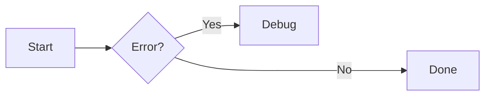
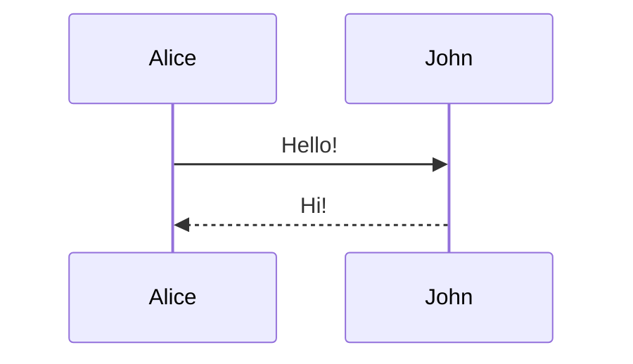

# Authoring

## Markdown Basics

Zensical uses Python Markdown for compatibility with Material for MkDocs. Use relative links to other Markdown files — Zensical translates them correctly.

Page title priority: nav config → front matter → first H1 → filename.

---

## Admonitions

Requires: `admonition`, `pymdownx.details`, `pymdownx.superfences`

```toml
[project.markdown_extensions.admonition]
[project.markdown_extensions.pymdownx.details]
[project.markdown_extensions.pymdownx.superfences]
```

### Basic admonition

```markdown
!!! note

    Content here, indented four spaces.
```

### Custom title

```markdown
!!! note "My Custom Title"

    Content here.
```

### No title

```markdown
!!! note ""

    Content here.
```

### Collapsible

```markdown
??? note

    Collapsed by default.

???+ note

    Expanded by default.
```

### Inline blocks

```markdown
!!! info inline end "Title"

    Floats to the right.

!!! info inline "Title"

    Floats to the left.
```

### Supported types

`note`, `abstract`, `info`, `tip`, `success`, `question`, `warning`, `failure`, `danger`, `bug`, `example`, `quote`

### Nested admonitions

```markdown
!!! note "Outer"

    Outer content.

    !!! note "Inner"

        Inner content.
```

---

## Code Blocks

Requires:

```toml
[project.markdown_extensions.pymdownx.highlight]
anchor_linenums = true
line_spans = "__span"
pygments_lang_class = true
[project.markdown_extensions.pymdownx.inlinehilite]
[project.markdown_extensions.pymdownx.snippets]
[project.markdown_extensions.pymdownx.superfences]
```

Enable copy/select buttons globally:

```toml
[project.theme]
features = ["content.code.copy", "content.code.select"]
```

### Basic code block

````markdown
``` py
import tensorflow as tf
```
````

### With title

````markdown
``` py title="bubble_sort.py"
def bubble_sort(items):
    pass
```
````

### With line numbers

````markdown
``` py linenums="1"
def bubble_sort(items):
    pass
```
````

### Highlight specific lines

````markdown
``` py hl_lines="2 3"
def f():
    x = 1
    y = 2
    return x + y
```
````

Line ranges: `hl_lines="3-5"`

### Annotations

````markdown
``` toml
features = ["content.code.annotate"] # (1)!
```

1.  I'm a code annotation!
````

Strip comment characters with `!`:

````markdown
``` yaml
# (1)!
```

1.  Less noise!
````

### Inline code highlighting

```markdown
The `#!python range()` function generates a sequence.
```

### Embed external files

````markdown
``` title=".browserslistrc"
;--8<-- ".browserslistrc"
```
````

### Per-block copy/select toggle

````markdown
``` { .yaml .copy }
code here
```

``` { .yaml .no-copy }
code here
```
````

---

## Content Tabs

Requires:

```toml
[project.markdown_extensions.pymdownx.superfences]
[project.markdown_extensions.pymdownx.tabbed]
alternate_style = true
```

Linked tabs (sync across page):

```toml
features = ["content.tabs.link"]
```

### Code tabs

```markdown
=== "Python"

    ``` py
    print("Hello")
    ```

=== "JavaScript"

    ``` js
    console.log("Hello")
    ```
```

### Other content tabs

```markdown
=== "Unordered list"

    * Item 1
    * Item 2

=== "Ordered list"

    1. Item 1
    2. Item 2
```

### Tabs in admonitions

```markdown
!!! example

    === "Tab A"

        Content A

    === "Tab B"

        Content B
```

---

## Data Tables

Requires:

```toml
[project.markdown_extensions.tables]
```

```markdown
| Method   | Description         |
| -------- | ------------------- |
| `GET`    | Fetch resource      |
| `DELETE` | Delete resource     |
```

### Column alignment

```markdown
| Left     | Center   | Right    |
| :------- | :------: | -------: |
| text     | text     | text     |
```

### Sortable tables

Add JavaScript:

```js
document$.subscribe(function() {
  var tables = document.querySelectorAll("article table:not([class])")
  tables.forEach(function(table) {
    new Tablesort(table)
  })
})
```

```toml
[project]
extra_javascript = [
  "https://unpkg.com/tablesort@5.3.0/dist/tablesort.min.js",
  "javascripts/tablesort.js"
]
```

---

## Diagrams (Mermaid.js)

Requires:

```toml
[project.markdown_extensions.pymdownx.superfences]
custom_fences = [
  { name = "mermaid", class = "mermaid", format = "pymdownx.superfences.fence_code_format" }
]
```

### Flowchart

````markdown

````

### Sequence diagram

````markdown

````

### State, class, entity-relationship diagrams are also supported.

---

## Footnotes

Requires:

```toml
[project.markdown_extensions.footnotes]
```

```markdown
Text with a footnote[^1].

[^1]: The footnote content.
```

Multi-line footnote:

```markdown
[^2]:
    First paragraph.

    Second paragraph.
```

Footnote tooltips:

```toml
features = ["content.footnote.tooltips"]
```

---

## Formatting

Requires:

```toml
[project.markdown_extensions.pymdownx.caret]
[project.markdown_extensions.pymdownx.keys]
[project.markdown_extensions.pymdownx.mark]
[project.markdown_extensions.pymdownx.tilde]
```

```markdown
- ==Highlighted==
- ^^Underlined^^
- ~~Strikethrough~~
- H~2~O
- A^T^A
- ++ctrl+alt+del++
```

---

## Front Matter

```yaml
---
title: Custom Page Title
description: Meta description for SEO
icon: lucide/braces
status: new
tags:
  - Tag1
template: my_template.html
hide:
  - navigation
  - toc
  - path
  - footer
  - tags
  - feedback
search:
  exclude: true
comments: true
robots: noindex, nofollow
---
```

Page status identifiers: `new`, `deprecated` (built-in). Custom statuses configured in `extra.status`.

---

## Grids

Requires:

```toml
[project.markdown_extensions.attr_list]
[project.markdown_extensions.md_in_html]
```

### Card grid (list syntax)

```html
<div class="grid cards" markdown>

- :fontawesome-brands-html5: __HTML__ for content
- :fontawesome-brands-js: __JavaScript__ for interactivity

</div>
```

### Card grid (block syntax)

```html
<div class="grid" markdown>

Content block
{ .card }

> Blockquote

</div>
```

### Generic grid

```html
<div class="grid" markdown>

=== "Tab A"
    Content A

=== "Tab B"
    Content B

``` title="Example"
code here
```

</div>
```

---

## Icons and Emojis

Requires:

```toml
[project.markdown_extensions.attr_list]
[project.markdown_extensions.pymdownx.emoji]
```

```markdown
:smile:
:fontawesome-regular-face-laugh-wink:
:fontawesome-brands-youtube:{ .youtube }
:octicons-heart-fill-24:{ .heart }
```

Use in templates:

```html
<span class="twemoji">
  
</span>
```

---

## Images

Requires:

```toml
[project.markdown_extensions.attr_list]
[project.markdown_extensions.md_in_html]
[project.markdown_extensions.pymdownx.blocks.caption]
```

### Alignment

```markdown
{ align=left }
{ align=right }
```

### Caption

```markdown
{ width="300" }
/// caption
Image caption
///
```

Or with HTML:

```html
<figure markdown="span">
  { width="300" }
  <figcaption>Caption</figcaption>
</figure>
```

### Lazy loading

```markdown
{ loading=lazy }
```

### Light/dark mode images

```markdown


```

---

## Lists

Requires (for definition lists and task lists):

```toml
[project.markdown_extensions.def_list]
[project.markdown_extensions.pymdownx.tasklist]
custom_checkbox = true
```

### Unordered and ordered lists

Standard Markdown syntax. Lists can be nested.

### Definition lists

```markdown
`Term`
:   Definition paragraph.

`Another term`
:   Another definition.
```

### Task lists

```markdown
- [x] Done item
- [ ] Pending item
    * [x] Nested done
    * [ ] Nested pending
```

---

## Math

### MathJax

```toml
[project]
extra_javascript = [
  "javascripts/mathjax.js",
  "https://unpkg.com/mathjax@3/es5/tex-mml-chtml.js"
]

[project.markdown_extensions.pymdownx.arithmatex]
generic = true
```

`docs/javascripts/mathjax.js`:

```js
window.MathJax = {
  tex: {
    inlineMath: [["\\(", "\\)"]],
    displayMath: [["\\[", "\\]"]],
    processEscapes: true,
    processEnvironments: true
  },
  options: {
    ignoreHtmlClass: ".*|",
    processHtmlClass: "arithmatex"
  }
};

document$.subscribe(() => {
  MathJax.startup.output.clearCache()
  MathJax.typesetClear()
  MathJax.texReset()
  MathJax.typesetPromise()
})
```

Block math:

```latex
$$
\cos x=\sum_{k=0}^{\infty}\frac{(-1)^k}{(2k)!}x^{2k}
$$
```

Inline math: `$f(x) = x^2$`

### KaTeX (alternative)

```toml
[project]
extra_javascript = [
  "javascripts/katex.js",
  "https://unpkg.com/katex@0/dist/katex.min.js",
  "https://unpkg.com/katex@0/dist/contrib/auto-render.min.js"
]
extra_css = ["https://unpkg.com/katex@0/dist/katex.min.css"]

[project.markdown_extensions.pymdownx.arithmatex]
generic = true
```

---

## Tooltips and Abbreviations

Requires:

```toml
[project.markdown_extensions.abbr]
[project.markdown_extensions.attr_list]
[project.markdown_extensions.pymdownx.snippets]
```

Improved tooltips:

```toml
features = ["content.tooltips"]
```

### Link tooltip

```markdown
[Hover me](https://example.com "I'm a tooltip!")
```

### Icon tooltip

```markdown
:material-information-outline:{ title="Important information" }
```

### Abbreviations

```markdown
The HTML spec is maintained by the W3C.

*[HTML]: Hyper Text Markup Language
*[W3C]: World Wide Web Consortium
```

### Glossary (auto-append)

```toml
[project.markdown_extensions.pymdownx.snippets]
auto_append = ["includes/abbreviations.md"]
```

---

## Buttons

Requires:

```toml
[project.markdown_extensions.attr_list]
```

```markdown
[Button](#){ .md-button }
[Primary Button](#){ .md-button .md-button--primary }
[Send :fontawesome-solid-paper-plane:](#){ .md-button }